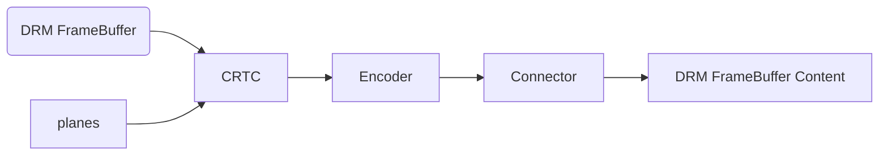

## DRM

参考https://blog.csdn.net/hexiaolong2009/article/category/8331603

### 简介

DRM是Linux目前主流的图形显示框架，DRM支持多层和成，支持VSYNC，DMABUF，异步更新，fence机制，DRM可以统一管理GPU和Display驱动，使得软件架构更为统一。

可以分为三部分：libdrm，KMS，GEM

- libdrm：对底层ioctl接口进行封装，向上提供通用的API接口
- KMS：Kernel Mode Setting，主要就是更新画面和设置显示参数
  - 更新画面：切换显示Buffer，多图层的合成，以及没个图层的显示位置
  - 设置显示参数：分辨率、刷新率，电源状态
- GEM：Graphic Execution Manager，负责显示buffer的分配和释放，是GPU唯一用到DRM的地方

DRM框架涉及到的元素：

KMS: crtc, encoder, connector, plane, fb, vblank, property

GEM: dumb, prime, fence



| 元素      | 说明                                                         |
| --------- | ------------------------------------------------------------ |
| CRTC      | 对显示buffer进行扫描，并产生时序信号的硬件模块，通常指Display Controller |
| ENCODER   | 负责将CRTC输出的timing时序转换成外部设备所需要的信号的模块，如HDMI转换器或DSI Controller |
| CONNECTOR | 连接物理显示设备的连接器，如HDMI、DisplayPort、DSI总线，通常和Encoder驱动绑定在一起 |
| PLANE     | 硬件图层，有的Display硬件支持多层合成显示，但所有的Display Controller至少要有1个plane |
| FB        | Framebuffer，单个图层的显示内容，唯一一个和硬件无关的基本元素 |
| VBLANK    | 软件和硬件的同步机制，RGB时序中的垂直消影区，软件通常使用硬件VSYNC来实现 |
| property  | 任何你想设置的参数，都可以做成property，是DRM驱动中最灵活、最方便的Mode setting机制 |
| DUMB      | 只支持连续物理内存，基于kernel中通用CMA API实现，多用于小分辨率简单场景 |
| PRIME     | 连续、非连续物理内存都支持，基于DMA-BUF机制，可以实现buffer共享，多用于大内存复杂场景 |
| fence     | buffer同步机制，基于内核dma_fence机制实现，用于防止显示内容出现异步问题 |

### single buffer显示

伪代码：

```c
int main(int argc, char **argv)
{
	/* open the drm device */
	open("/dev/dri/card0");

	/* get crtc/encoder/connector id */
	drmModeGetResources(...);

	/* get connector for display mode */
	drmModeGetConnector(...);

	/* create a dumb-buffer */
	drmIoctl(DRM_IOCTL_MODE_CREATE_DUMB);

	/* bind the dumb-buffer to an FB object */
	drmModeAddFB(...);

	/* map the dumb buffer for userspace drawing */
	drmIoctl(DRM_IOCTL_MODE_MAP_DUMB);
	mmap(...);

	/* start display */
	drmModeSetCrtc(crtc_id, fb_id, connector_id, mode);
}
```

详细代码

```c
#define _GNU_SOURCE
#include <errno.h>
#include <fcntl.h>
#include <stdbool.h>
#include <stdint.h>
#include <stdio.h>
#include <stdlib.h>
#include <string.h>
#include <sys/mman.h>
#include <time.h>
#include <unistd.h>
#include <xf86drm.h>
#include <xf86drmMode.h>

struct buffer_object {
	uint32_t width;
	uint32_t height;
	uint32_t pitch;
	uint32_t handle;
	uint32_t size;
	uint8_t *vaddr;
	uint32_t fb_id;
};

struct buffer_object buf;

static int modeset_create_fb(int fd, struct buffer_object *bo)
{
	struct drm_mode_create_dumb create = {};
 	struct drm_mode_map_dumb map = {};

	/* create a dumb-buffer, the pixel format is XRGB888 */
	create.width = bo->width;
	create.height = bo->height;
	create.bpp = 32;
	drmIoctl(fd, DRM_IOCTL_MODE_CREATE_DUMB, &create);

	/* bind the dumb-buffer to an FB object */
	bo->pitch = create.pitch;
	bo->size = create.size;
	bo->handle = create.handle;
	drmModeAddFB(fd, bo->width, bo->height, 24, 32, bo->pitch,
			   bo->handle, &bo->fb_id);

	/* map the dumb-buffer to userspace */
	map.handle = create.handle;
	drmIoctl(fd, DRM_IOCTL_MODE_MAP_DUMB, &map);

	bo->vaddr = mmap(0, create.size, PROT_READ | PROT_WRITE,
			MAP_SHARED, fd, map.offset);

	/* initialize the dumb-buffer with white-color */
	memset(bo->vaddr, 0xff, bo->size);

	return 0;
}

static void modeset_destroy_fb(int fd, struct buffer_object *bo)
{
	struct drm_mode_destroy_dumb destroy = {};

	drmModeRmFB(fd, bo->fb_id);

	munmap(bo->vaddr, bo->size);

	destroy.handle = bo->handle;
	drmIoctl(fd, DRM_IOCTL_MODE_DESTROY_DUMB, &destroy);
}

int main(int argc, char **argv)
{
	int fd;
	drmModeConnector *conn;
	drmModeRes *res;
	uint32_t conn_id;
	uint32_t crtc_id;

	fd = open("/dev/dri/card0", O_RDWR | O_CLOEXEC); //打开显示设备fd

	res = drmModeGetResources(fd); //由fd获取显示设备的资源res
	crtc_id = res->crtcs[0]; //由res获取crtc_id
	conn_id = res->connectors[0]; //由res获取conn_id

	conn = drmModeGetConnector(fd, conn_id); //由fd和conn_id获取connector
	buf.width = conn->modes[0].hdisplay; //conn中获取和设置buf的高和宽
	buf.height = conn->modes[0].vdisplay;

	modeset_create_fb(fd, &buf); //在指定fd上创建上述尺寸的fb

	drmModeSetCrtc(fd, crtc_id, buf.fb_id, 0, 0, &conn_id, 1, &conn->modes[0]); //底下会细说

	getchar();

	modeset_destroy_fb(fd, &buf);

	drmModeFreeConnector(conn);
	drmModeFreeResources(res);

	close(fd);

	return 0;
}
```

`drmModeSetCrtc()`利用前面获得的参数，包括设备fd，crtc，buf的fb_id，conn_id等参数，将底层显示的pipeline都初始化好了，并且在屏幕上显示了fb的内容。

上述代码删除了一些异常处理代码，想要正常运行，需满足如下：

- drm驱动支持modeset；
- drm驱动支持dumb-buffer（连续物理内存）；
- drm驱动至少支持1个crtc，1个encoder，1个connector；
- drm驱动的connector至少包含一个有效的drm_display_mode.

### double buffer显示

就是双buffer前后台切换，很好理解

伪代码

```c
int main(void)
{
    ...
    while(1) {
        drmModeSetCrtc(fb0);
        ...
        drmModeSetCrtc(fb1);
        ...
    }
    ...
}
```

详细代码

```c
#define _GNU_SOURCE
#include <errno.h>
#include <fcntl.h>
#include <stdbool.h>
#include <stdint.h>
#include <stdio.h>
#include <stdlib.h>
#include <string.h>
#include <sys/mman.h>
#include <time.h>
#include <unistd.h>
#include <xf86drm.h>
#include <xf86drmMode.h>

struct buffer_object {
	uint32_t width;
	uint32_t height;
	uint32_t pitch;
	uint32_t handle;
	uint32_t size;
	uint32_t *vaddr;
	uint32_t fb_id;
};

struct buffer_object buf[2];

static int modeset_create_fb(int fd, struct buffer_object *bo, uint32_t color)
{
	struct drm_mode_create_dumb create = {};
 	struct drm_mode_map_dumb map = {};
	uint32_t i;

	create.width = bo->width;
	create.height = bo->height;
	create.bpp = 32;
	drmIoctl(fd, DRM_IOCTL_MODE_CREATE_DUMB, &create);

	bo->pitch = create.pitch;
	bo->size = create.size;
	bo->handle = create.handle;
	drmModeAddFB(fd, bo->width, bo->height, 24, 32, bo->pitch,
			   bo->handle, &bo->fb_id);

	map.handle = create.handle;
	drmIoctl(fd, DRM_IOCTL_MODE_MAP_DUMB, &map);

	bo->vaddr = mmap(0, create.size, PROT_READ | PROT_WRITE,
			MAP_SHARED, fd, map.offset);

	for (i = 0; i < (bo->size / 4); i++)
		bo->vaddr[i] = color;

	return 0;
}

static void modeset_destroy_fb(int fd, struct buffer_object *bo)
{
	struct drm_mode_destroy_dumb destroy = {};

	drmModeRmFB(fd, bo->fb_id);

	munmap(bo->vaddr, bo->size);

	destroy.handle = bo->handle;
	drmIoctl(fd, DRM_IOCTL_MODE_DESTROY_DUMB, &destroy);
}

int main(int argc, char **argv)
{
	int fd;
	drmModeConnector *conn;
	drmModeRes *res;
	uint32_t conn_id;
	uint32_t crtc_id;

	fd = open("/dev/dri/card0", O_RDWR | O_CLOEXEC);

	res = drmModeGetResources(fd);
	crtc_id = res->crtcs[0];
	conn_id = res->connectors[0];

	conn = drmModeGetConnector(fd, conn_id);
	buf[0].width = conn->modes[0].hdisplay;
	buf[0].height = conn->modes[0].vdisplay;
	buf[1].width = conn->modes[0].hdisplay;
	buf[1].height = conn->modes[0].vdisplay;

	modeset_create_fb(fd, &buf[0], 0xff0000);
	modeset_create_fb(fd, &buf[1], 0x0000ff);

	drmModeSetCrtc(fd, crtc_id, buf[0].fb_id,
			0, 0, &conn_id, 1, &conn->modes[0]);

	getchar();

	drmModeSetCrtc(fd, crtc_id, buf[1].fb_id,
			0, 0, &conn_id, 1, &conn->modes[0]);

	getchar();

	modeset_destroy_fb(fd, &buf[1]);
	modeset_destroy_fb(fd, &buf[0]);

	drmModeFreeConnector(conn);
	drmModeFreeResources(res);

	close(fd);

	return 0;
}
```

其实跟single buffer的流程是完全一样的，不一样的地方就在于它有两个buffer，在写正式的应用的时候可能不止两个来处理（因为前边给的buffer可能也会比较多）

### page-flip vsync

前面的显示都是使用的`drmModeSetCrtc()`进行图像的更新，这里用到另一个接口，`drmModePageFlip()`，两者的区别在于，`drmModeSetCrtc()`会立即执行fb的切换，有可能造成**撕裂**问题，而`drmModePageFlip()`不会造成这个问题，需要：

- drm驱动支持VBLANK事件

伪代码：

```c
void my_page_flip_handler(...)
{
	drmModePageFlip(DRM_MODE_PAGE_FLIP_EVENT);
	...
}

int main(void)
{
	drmEventContext ev = {};

	ev.version = DRM_EVENT_CONTEXT_VERSION;
	ev.page_flip_handler = my_page_flip_handler;
	...

	drmModePageFlip(DRM_MODE_PAGE_FLIP_EVENT);
	
	while (1) {
		drmHandleEvent(&ev);
	}
}
```

详细代码：

```c
#define _GNU_SOURCE
#include <errno.h>
#include <fcntl.h>
#include <stdbool.h>
#include <stdint.h>
#include <stdio.h>
#include <stdlib.h>
#include <string.h>
#include <sys/mman.h>
#include <time.h>
#include <unistd.h>
#include <signal.h>
#include <xf86drm.h>
#include <xf86drmMode.h>

struct buffer_object {
	uint32_t width;
	uint32_t height;
	uint32_t pitch;
	uint32_t handle;
	uint32_t size;
	uint32_t *vaddr;
	uint32_t fb_id;
};

struct buffer_object buf[2];
static int terminate;

static int modeset_create_fb(int fd, struct buffer_object *bo, uint32_t color)
{
	struct drm_mode_create_dumb create = {};
 	struct drm_mode_map_dumb map = {};
	uint32_t i;

	create.width = bo->width;
	create.height = bo->height;
	create.bpp = 32;
	drmIoctl(fd, DRM_IOCTL_MODE_CREATE_DUMB, &create);

	bo->pitch = create.pitch;
	bo->size = create.size;
	bo->handle = create.handle;
	drmModeAddFB(fd, bo->width, bo->height, 24, 32, bo->pitch,
			   bo->handle, &bo->fb_id);

	map.handle = create.handle;
	drmIoctl(fd, DRM_IOCTL_MODE_MAP_DUMB, &map);

	bo->vaddr = mmap(0, create.size, PROT_READ | PROT_WRITE,
			MAP_SHARED, fd, map.offset);

	for (i = 0; i < (bo->size / 4); i++)
		bo->vaddr[i] = color;

	return 0;
}

static void modeset_destroy_fb(int fd, struct buffer_object *bo)
{
	struct drm_mode_destroy_dumb destroy = {};

	drmModeRmFB(fd, bo->fb_id);

	munmap(bo->vaddr, bo->size);

	destroy.handle = bo->handle;
	drmIoctl(fd, DRM_IOCTL_MODE_DESTROY_DUMB, &destroy);
}

static void modeset_page_flip_handler(int fd, uint32_t frame,
				    uint32_t sec, uint32_t usec,
				    void *data)
{
	static int i = 0;
	uint32_t crtc_id = *(uint32_t *)data;

	i ^= 1; //两个buffer倒是可以，但是buffer要是再多的话，就不能用这个了

	drmModePageFlip(fd, crtc_id, buf[i].fb_id,
			DRM_MODE_PAGE_FLIP_EVENT, data);

	usleep(500000);
}

static void sigint_handler(int arg)
{
	terminate = 1;
}

int main(int argc, char **argv)
{
	int fd;
	drmEventContext ev = {};
	drmModeConnector *conn;
	drmModeRes *res;
	uint32_t conn_id;
	uint32_t crtc_id;

	/* register CTRL+C terminate interrupt */
	signal(SIGINT, sigint_handler);

	ev.version = DRM_EVENT_CONTEXT_VERSION;
	ev.page_flip_handler = modeset_page_flip_handler;

	fd = open("/dev/dri/card0", O_RDWR | O_CLOEXEC);

	res = drmModeGetResources(fd);
	crtc_id = res->crtcs[0];
	conn_id = res->connectors[0];

	conn = drmModeGetConnector(fd, conn_id);
	buf[0].width = conn->modes[0].hdisplay;
	buf[0].height = conn->modes[0].vdisplay;
	buf[1].width = conn->modes[0].hdisplay;
	buf[1].height = conn->modes[0].vdisplay;

	modeset_create_fb(fd, &buf[0], 0xff0000);
	modeset_create_fb(fd, &buf[1], 0x0000ff);

	drmModeSetCrtc(fd, crtc_id, buf[0].fb_id,
			0, 0, &conn_id, 1, &conn->modes[0]);

	drmModePageFlip(fd, crtc_id, buf[0].fb_id,
			DRM_MODE_PAGE_FLIP_EVENT, &crtc_id);

	while (!terminate) {
		drmHandleEvent(fd, &ev);
	}

	modeset_destroy_fb(fd, &buf[1]);
	modeset_destroy_fb(fd, &buf[0]);

	drmModeFreeConnector(conn);
	drmModeFreeResources(res);

	close(fd);

	return 0;
}
```

也就是定义一个事件，有个回调，当触发事件的时候，调用回调在回调中调用`drmModePageFlip()`来进行图像的刷新。

`drmModePageFlip()`依赖`drmHandleEvent()`，该函数内部阻塞等待底层驱动返回相应的VBLANK事件，以确保VSYNC同步，在同一个VSYNC周期内，`drmModePageFlip()`只能被调用一次，多次调用的话，只有第一次调用有效，后面都会返回-EBUSY错误。

- **撕裂问题**：根本原因是对内存的读写速度不一致导致的，当读比写快的时候，比如R:W=3:1，有：
- 0. 此时R和W指针都指向起点，内存中是第一帧完整图像，R和W指针同时匀速操作
  1. 此时R读完一帧数据，W只写了1/3新的数据，R回到起点，W在1/3的位置
  2. 追及问题，R会追上W，即RW指针重叠
  3. 接下来R读到的就是旧的未经W更新的数据，那么显示出来的图像就是一半旧的一半新的，即撕裂
- 参考https://blog.csdn.net/hexiaolong2009/article/details/79319512，没看完，挺详细的

### plane-test

这里的plane和yuv的plane不是一个概念，yuv的plane指的是图像数据在内存中的排列方式，一般Y通道会占据一段连续的内存，UV占据另一块连续的内存。drm中的plane指的是Display Controller中用于多层合成的单个硬件图形模块，属于硬件层面。

> Plane的历史
>
> 随着软件技术的不断更新，对硬件的性能要求越来越高，在满足功能正常使用的前提下，对功耗的要求也越来越苛刻。本来GPU可以处理所有图形任务，但是由于它运行时的功耗实在太高，设计者们决定将一部分简单的任务交给Display Controller去处理（比如合成），而让GPU专注于绘图（即渲染）这一主要任务，减轻GPU的负担，从而达到降低功耗提升性能的目的。于是，Plane（硬件图层单元）就诞生了。
>  

plane连接FB与CRTC

伪代码：

```c
int main(void)
{
	...
	drmSetClientCap(DRM_CLIENT_CAP_UNIVERSAL_PLANES);
	drmModeGetPlaneResources();

	drmModeSetPlane(plane_id, crtc_id, fb_id, 0,
			crtc_x, crtc_y, crtc_w, crtc_h,
			src_x, src_y, src_w << 16, src_h << 16);
	...
}
```

- 当 SRC_X/Y 和 CRTC_X/Y 不相等时，就实现了平移的效果；
- 当 SRC_W/H 和 CRTC_W/H 不相等时，就实现了缩放的效果；
- 当 SRC_W/H 和 FB_W/H 不相等时，就实现了裁剪的效果；

一个高级plane：

|功能|	说明|
|---|---|
|Crop|	裁剪，如上图|
|Scaling	|缩放，放大或缩小|
|Rotation|	旋转，90° 180° 270° X/Y镜像|
|Z-Order|	Z-顺序，调整当前层在总图层中的Z轴顺序|
|Blending|	合成，pixel alpha / global alpha|
|Format|	颜色格式，ARGB888 XRGB888 YUV420 等|

上述功能都是由硬件完成（也就是不占CPU？）

drm框架中，plane分为三个类型

| 类型    | 说明                                      |
| ------- | ----------------------------------------- |
| Cursor  | 光标图层，用于PC系统显示鼠标              |
| Overlay | 叠加图层，通常用于YUV格式的视频图层       |
| Primary | 主要图层，通常用于仅支持RGB格式的简单图层 |

> 其实随着现代半导体技术的飞速发展，Overlay Plane和Primary Plane之间已经没有明显的界限了，许多芯片的图层处理能力已经非常强大，不仅仅可以处理简单的RGB格式，也可以处理YUV视频格式，甚至FBC压缩格式。针对这类硬件图层，它既可以是Overlay Plane，也可以是Primary Plane，至于驱动如何定义，就要看工程师的喜好了。
>
> 而对于一些早期处理能力比较弱的硬件，为了节约成本，每个图层支持的格式并不一样，比如将平常使用格式最多的RGB图层作为Primary Plane，而将平时用不多的YUV视频图层作为Overlay Plane，那么这个时候上层应用程序在使用这两种plane的时候就需要区别对待了。
>  

为什么要设置DRM_CLIENT_CAP_UNIVERSAL_PLANES ？

因为如果不设置，drmModeGetPlaneResources()就只会返回Overlay Plane，其他Plane都不会返回。而如果设置了，DRM驱动则会返回所有支持的Plane资源，包括cursor、overlay和primary。

代码：

```c
#define _GNU_SOURCE
#include <errno.h>
#include <fcntl.h>
#include <stdbool.h>
#include <stdint.h>
#include <stdio.h>
#include <stdlib.h>
#include <string.h>
#include <sys/mman.h>
#include <time.h>
#include <unistd.h>
#include <xf86drm.h>
#include <xf86drmMode.h>

struct buffer_object {
	uint32_t width;
	uint32_t height;
	uint32_t pitch;
	uint32_t handle;
	uint32_t size;
	uint8_t *vaddr;
	uint32_t fb_id;
};

struct buffer_object buf;

static int modeset_create_fb(int fd, struct buffer_object *bo)
{
	struct drm_mode_create_dumb create = {};
 	struct drm_mode_map_dumb map = {};

	create.width = bo->width;
	create.height = bo->height;
	create.bpp = 32;
	drmIoctl(fd, DRM_IOCTL_MODE_CREATE_DUMB, &create);

	bo->pitch = create.pitch;
	bo->size = create.size;
	bo->handle = create.handle;
	drmModeAddFB(fd, bo->width, bo->height, 24, 32, bo->pitch,
			   bo->handle, &bo->fb_id);

	map.handle = create.handle;
	drmIoctl(fd, DRM_IOCTL_MODE_MAP_DUMB, &map);

	bo->vaddr = mmap(0, create.size, PROT_READ | PROT_WRITE,
			MAP_SHARED, fd, map.offset);

	memset(bo->vaddr, 0xff, bo->size);

	return 0;
}

static void modeset_destroy_fb(int fd, struct buffer_object *bo)
{
	struct drm_mode_destroy_dumb destroy = {};

	drmModeRmFB(fd, bo->fb_id);

	munmap(bo->vaddr, bo->size);

	destroy.handle = bo->handle;
	drmIoctl(fd, DRM_IOCTL_MODE_DESTROY_DUMB, &destroy);
}

int main(int argc, char **argv)
{
	int fd;
	drmModeConnector *conn;
	drmModeRes *res;
	drmModePlaneRes *plane_res;
	uint32_t conn_id;
	uint32_t crtc_id;
	uint32_t plane_id;

	fd = open("/dev/dri/card0", O_RDWR | O_CLOEXEC);

	res = drmModeGetResources(fd);
	crtc_id = res->crtcs[0];
	conn_id = res->connectors[0];

	drmSetClientCap(fd, DRM_CLIENT_CAP_UNIVERSAL_PLANES, 1);
	plane_res = drmModeGetPlaneResources(fd);
	plane_id = plane_res->planes[0];

	conn = drmModeGetConnector(fd, conn_id);
	buf.width = conn->modes[0].hdisplay;
	buf.height = conn->modes[0].vdisplay;

	modeset_create_fb(fd, &buf);

	drmModeSetCrtc(fd, crtc_id, buf.fb_id,
			0, 0, &conn_id, 1, &conn->modes[0]);

	getchar();

	/* crop the rect from framebuffer(100, 150) to crtc(50, 50) */
	drmModeSetPlane(fd, plane_id, crtc_id, buf.fb_id, 0,
			50, 50, 320, 320,
			100, 150, 320 << 16, 320 << 16);

	getchar();

	modeset_destroy_fb(fd, &buf);

	drmModeFreeConnector(conn);
	drmModeFreePlaneResources(plane_res);
	drmModeFreeResources(res);

	close(fd);

	return 0;
}
```

### Property

前面的内容使用的接口都已经是Legacy的了，现在推荐使用的是Atomic的接口，property是atomic必须依赖的元素

实际就是将前面的使用legacy接口传入的参数单独抽出来，做成全局属性，通过设置属性参数，即可完成对显示参数的设置

property主要由3部分组成：name、id和value，id为该property在drm框架中全局唯一的标识符

采用property机制的好处是：

> 1. 减少上层应用接口的维护工作量。当开发者有新的功能需要添加时，无需增加新的函数名和IOCTL，只需在底层驱动中新增一个property，然后在自己的应用程序中获取/操作该property的值即可。
> 2. 增强了参数设置的灵活性。一次IOCTL可以同时设置多个property，减少了user space与kernel space切换的次数，同时最大限度的满足了不同硬件对于参数设置的要求，提高了软件效率。
>    

drm中的property大多以功能划分，有一组standard properties，这些properties在任何平台上都会被创建

常用的property

**CRTC**

| name            | desctription                                                 |
| --------------- | ------------------------------------------------------------ |
| ACTIVE          | CRTC当前的使能状态，一般用于控制CRTC上下电                   |
| MODE_ID	CRTC | 当前所使用的display mode ID，通过该ID可以找到具体的display mode配置参数 |
| OUT_FENCE_PTR   | 输出fence指针，指向当前正在显示的buffer所对应的fence fd，该fence由DRM驱动创建，供上层应用程序使用，用来表示当前buffer CRTC是否还在占用 |

(optional)

| name             | desctription                                             |
| ---------------- | -------------------------------------------------------- |
| DEGAMMA_LUT      | de-gamma查找表参数                                       |
| DEGAMMA_LUT_SIZE | de-gamma查找表参数长度                                   |
| CTM              | Color Transformation Matrix，颜色矩阵转换参数，3x3的矩阵 |
| GAMMA_LUT        | gamma查找表参数                                          |
| GAMMA_LUT_SIZE   | gamma查找表参数长度                                      |

**PLANE**

| name        | desctription                                                 |
| ----------- | ------------------------------------------------------------ |
| type        | plane的类型，CURSOR、PRIMARY或者OVERLAY                      |
| FB_ID       | 与当前plane绑定的framebuffer object ID                       |
| IN_FENCE_FD | 与当前plane相关联的input fence fd，由buffer的生产者创建，供DRM底层驱动使用，用来标识当前传下来的buffer是否可以开始访问 |
| CRTC_ID     | 当前plane所关联的CRTC object ID，与CONNECTOR中的CRTC_ID属性是同一个property |
| SRC_X       | 当前framebuffer crop区域的起始偏移x坐标                      |
| SRC_Y       | 当前framebuffer crop区域的起始偏移y坐标                      |
| SRC_W       | 当前framebuffer crop区域的宽度                               |
| SRC_H       | 当前framebuffer crop区域的高度                               |
| CRTC_X      | 屏幕显示区域的起始偏移x坐标                                  |
| CRTC_Y      | 屏幕显示区域的起始偏移y坐标                                  |
| CRTC_W      | 屏幕显示区域的宽度                                           |
| CRTC_H      | 屏幕显示区域的高度                                           |

(optional)

|name|	desctription|
|---|-|
|IN_FORMATS|	用于标识特殊的颜色存储格式，如AFBC、IFBC存储格式，该属性为只读|
|rotation	|当前图层的旋转角度|
|zposition	|当前图层在所有图层中的Z轴顺序|
|alpha	|当前图层的global alpha（非pixel alpha），用于多层合成|
|pixel blend mode|	当前图层的合成方式，如Pre-multiplied/Coverage等|


### 环境

尝试在虚拟机上进行编译，发现缺少头文件，复制了头文件发现缺库文件，所以思考着安装，最终找到libdrm-nouveau2-dbg_2.4.67-1_amd64.deb和libdrm-dev，这里也尝试用dpkg -l看了一下，第一个包估摸着应该是有的，不确定是不是一定要有。